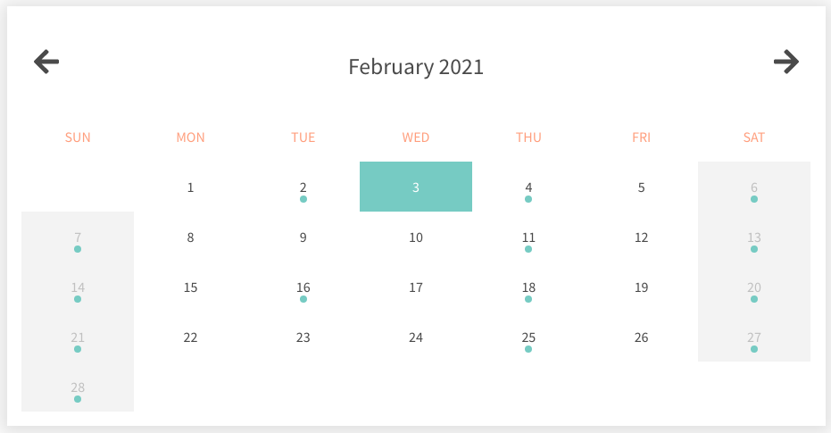
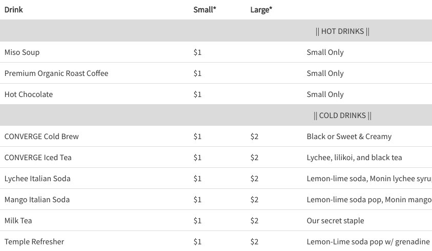

# Converge Website

Live Site: [convergehawaii.org](https://convergehawaii.org/)

**Stack:** Node.js, Express, Pug, SASS, Airtable API, Gulp, DigitalOcean

The Converge website is a responsive website built on several different reusable components using Pug templates and is powered by server-side rendering. By breaking up the website into components, some of them are reused on every page, such as the head, navigation bar, and footer. Most of the pages are also rendered from the same Pug template, but with different content. During render, different options can be passed into Pug to allow the page to behave differently, despite originating from the same template. All content is controlled by Airtable in a CMS-like fashion.

The Converge website uses a cron job to automate the process of syncing the Airtable-based CMS with the live content. When pulling data from the Airtable API, I encountered firsthand the issue of "callback hell" from all the asynchronous processes involved, which I would later learn how to cure with Promises, or better yet, async/await in ES8.

As one of my earliest projects that involved live deployment, here were a few takeaways I had:

- After switching domains, I learned how to conduct a 301 permanent redirect using Express, so that users are redirected to the new domain and browsers cache the redirect.
- I created an NPM postinstall script to auto-generate the necessary JSON files for caching data from the Airtable API. DigitalOcean automatically runs this postinstall script, along with the build script, upon every deployment.
- After putting forms on the site, I was careful to make sure each form requires a reCAPTCHA to submit, after which it is checked by server-side validation using validator.js and CSRF protection.

I also used Gulp, a build system, to complement my development. Gulp automatically compiles SASS into CSS, minifies JavaScript, and watches CSS + JS files to re-compile as needed. It also generates sourcemaps to preserve debugging. Lastly, I included a "serve" task that uses Browsersync to auto-reload the browser on new changes.

&nbsp;  
&nbsp;

  
*Some events on the calendar*

&nbsp;  
&nbsp;  

<!--   
*Some drinks on the menu* -->
