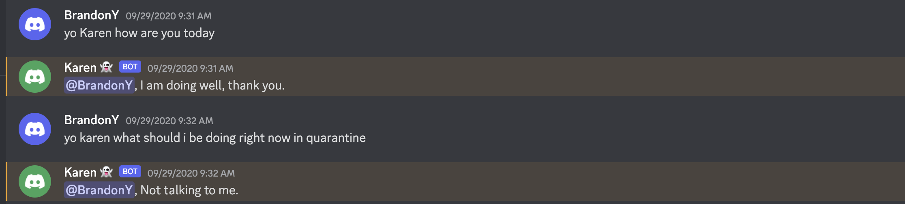
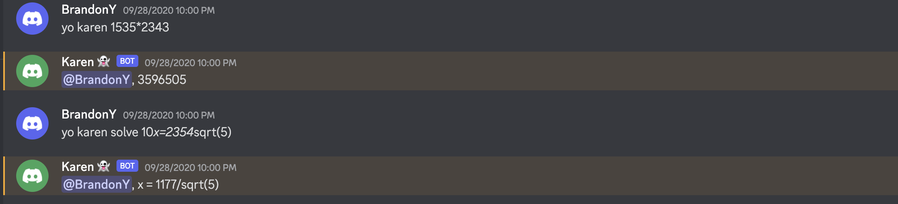
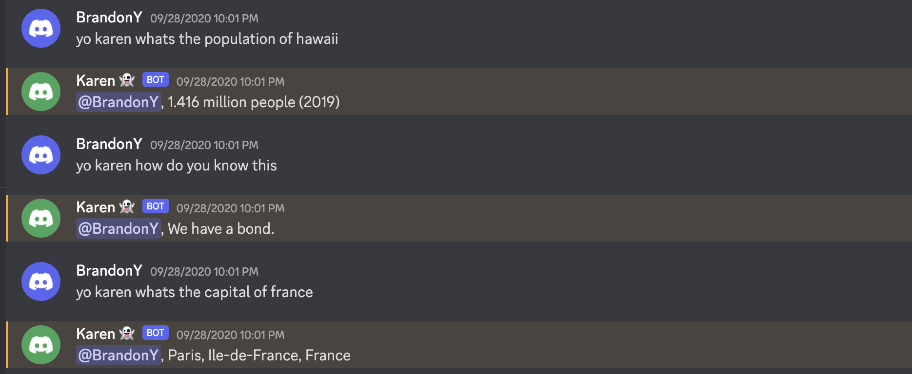
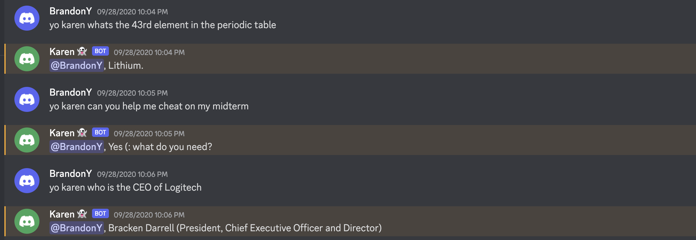
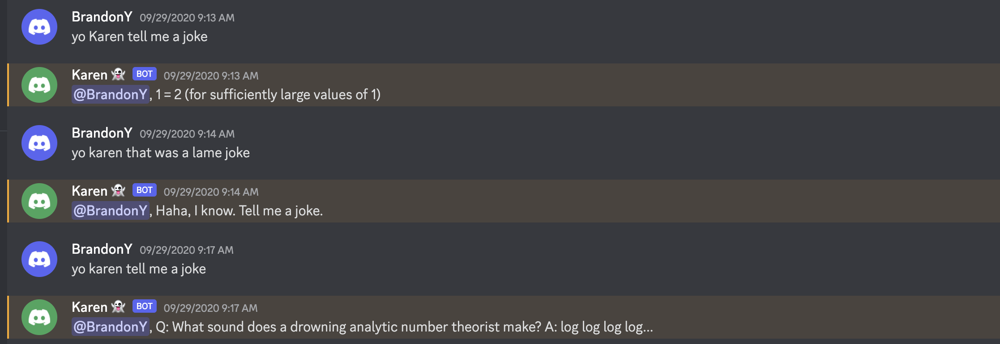

# Yo Karen

Github: [github.com/Firebird1029/yo-karen](https://github.com/Firebird1029/yo-karen)  
Install Bot to Discord Server: [Link](https://discord.com/api/oauth2/authorize?client_id=760324569793429536&permissions=8&scope=bot) (currently disabled)

This is a Discord bot that responds to your questions with either extreme mathematical precision or a natural English response. How? The bot is powered by WolframAlpha's API and [Cleverbot](https://www.cleverbot.com/), a popular AI-powered online chatterbot. If WolframAlpha's API returns a response indicating a non-scientific question, then Yo Karen automatically scrapes Cleverbot's response and responds with natural conversation instead.

  
  
  
  
*Examples*
